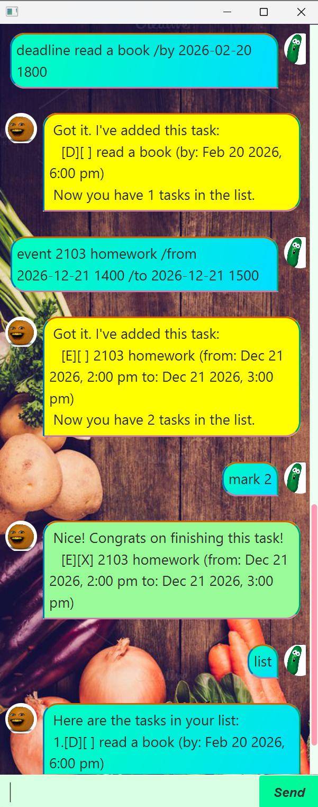

# Chatterbox User Guide


Welcome to Chatterbox! Your friendly task management assistant that helps you keep track of todos, deadlines, and events with ease.

---

## Getting Started

**What you need:**
- Java 17 or above installed on your system
- For Mac users, download this specific [version](https://www.azul.com/downloads/?version=java-17-lts&os=macos&package=jdk-fx#zulu)

**Installation steps:**
1. Grab the latest `chatterbox.jar` (v1.1) from [here](https://github.com/KenOKK3003/ip/releases/tag/LinuxFix)
2. Place it in any folder of your choice
3. Navigate to that folder in your terminal
4. Launch with: `java -jar chatterbox.jar`

---

## Understanding Commands

Before diving in, here are some conventions used throughout this guide:

> **`CAPITALISED_TEXT`** indicates values you should replace with your own input.  
> For instance, `todo TASK_NAME` means you'd type something like `todo Buy milk`.

> **Date/Time Format:** Always use `yyyy-MM-dd HHmm` format (24-hour clock).  
> Example: `2026-02-20 1430` means February 20th, 2026 at 2:30 PM.

> **Command Order Matters:** Follow the exact sequence shown in each command format.

> **Extra Text Ignored:** Commands like `list` and `bye` will ignore anything typed after them.

---

## Core Features

#### 📋 View All Tasks — `list`

Display everything on your task list at once.

```
list
```

Simple as that! You'll see all your todos, deadlines, and events with checkmarks showing what's completed.

---

#### ✅ Create a Todo — `todo`

For tasks without specific deadlines or timeframes.

```
todo TASK_DESCRIPTION
```

Real-world examples:
- `todo Finish reading chapter 3`
- `todo Schedule dentist appointment`
- `todo Order new keyboard`

> 📌 **Note:** Your task description can't be blank!

---

#### ⏰ Set a Deadline — `deadline`

When something needs to be done by a certain date and time.

```
deadline TASK_DESCRIPTION /by YYYY-MM-DD HHmm
```

Try these:
- `deadline Complete project report /by 2026-03-10 2359`
- `deadline Submit tax documents /by 2026-04-15 1700`
- `deadline Renew gym membership /by 2026-02-28 1200`

---

#### 📅 Schedule an Event — `event`

For activities with both start and end times.

```
event EVENT_NAME /from YYYY-MM-DD HHmm /to YYYY-MM-DD HHmm
```

Example scenarios:
- `event CS2103T lecture /from 2026-02-21 1600 /to 2026-02-21 1800`
- `event Dinner with friends /from 2026-02-25 1900 /to 2026-02-25 2200`
- `event Hackathon /from 2026-03-15 0900 /to 2026-03-16 1800`

---

#### ✓ Mark Complete — `mark`

Check off a task when you've finished it.

```
mark TASK_NUMBER
```

The task number comes from your list (use `list` to see numbers). Task numbers start from 1.

Usage tips:
- First run `list` to see which task is which
- Then `mark 3` to complete task #3
- Works after filtering with `find` too!

---

#### ↩️ Mark Incomplete — `unmark`

Changed your mind? Mark something as unfinished again.

```
unmark TASK_NUMBER
```

Same numbering system as `mark`. Use this when you realize a task isn't actually done yet.

---

#### 🔍 Search Tasks — `find`

Look up tasks by searching their descriptions.

```
find SEARCH_TERM [ADDITIONAL_TERMS]
```

Search behavior:
- Case doesn't matter (`Book` finds `book`)
- Finds partial matches anywhere in the description

Examples:
- `find report` → finds "Project report" and "Report findings"

---

#### 📆 Find by Date — `finddate`

See what's happening on a specific day.

```
finddate YYYY-MM-DD
```

This shows:
- Deadlines due that day
- Events occurring on or spanning that date

Try: `finddate 2026-03-15` to see everything scheduled for March 15th.

---

#### 🗑️ Remove a Task — `delete`

Permanently delete a task from your list.

```
delete TASK_NUMBER
```

Be careful—this can't be undone! Use `list` first to confirm the right task number.

Examples:
- `delete 5` removes the 5th task
- Can also delete from search results with `find` then `delete`

---

#### 👋 Exit Chatterbox — `bye`

Close the application when you're done.

```
bye
```

Your data is already saved, so just type `bye` and you're good to go!

---

## Data Management

**Conflict Detection**
If a newly added event overlaps with existing dates, chatterbox will give a warning.

**Automatic Saving**  
Every change you make gets saved instantly to `data/chatterbox.txt` in the same folder as your JAR file. No manual saving needed!

**Manual Editing (Advanced)**  
Tech-savvy users can directly edit the `data/chatterbox.txt` file if needed. However:

⚠️ **Warning:** Bad edits will cause Chatterbox to reset with a blank file next time. Always back up first! Incorrect formatting or invalid data can lead to unexpected behavior, so only edit if you know what you're doing.

---

## Quick Reference

| What                | How to do it                                                                                      |
|---------------------|---------------------------------------------------------------------------------------------------|
| View tasks          | `list`                                                                                            |
| Add todo            | `todo DESCRIPTION`<br>Example: `todo Water plants`                                               |
| Add deadline        | `deadline DESCRIPTION /by YYYY-MM-DD HHmm`<br>Example: `deadline Pay rent /by 2026-03-01 2300`  |
| Add event           | `event DESCRIPTION /from YYYY-MM-DD HHmm /to YYYY-MM-DD HHmm`<br>Example: `event Conference /from 2026-04-10 0900 /to 2026-04-10 1700` |
| Complete task       | `mark 2` (marks task 2 as done)                                                                   |
| Uncomplete task     | `unmark 2` (marks task 2 as not done)                                                             |
| Search              | `find homework` (finds tasks containing "homework")                                               |
| Check date          | `finddate 2026-03-20` (shows tasks on that date)                                                  |
| Remove task         | `delete 4` (deletes task 4)                                                                       |
| Close app           | `bye`                                                                                             |